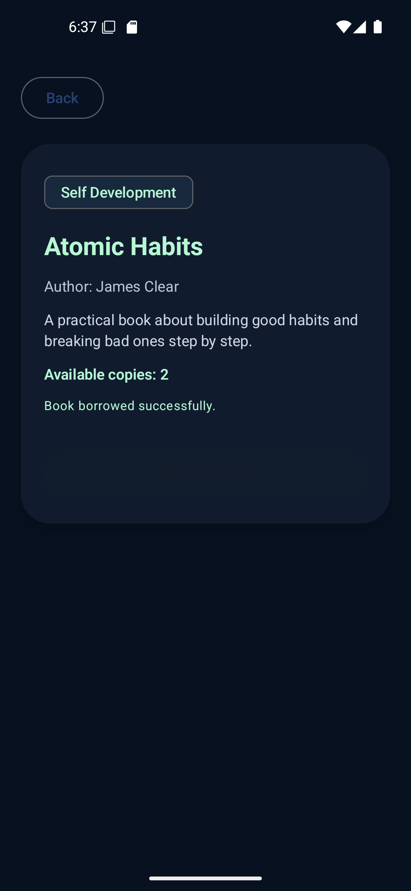
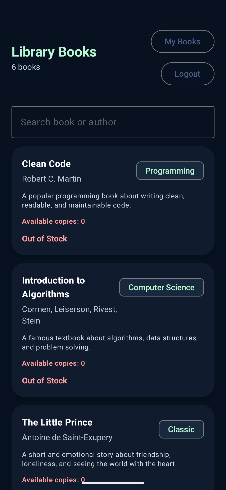
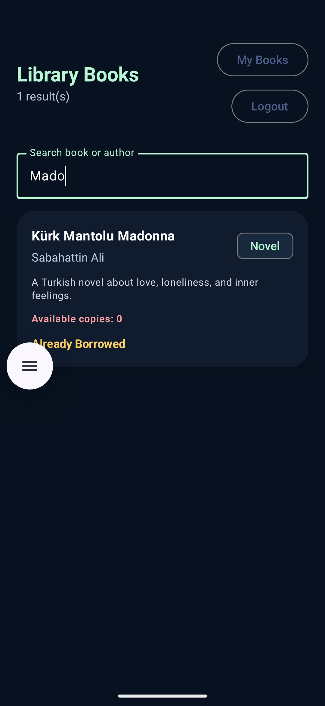
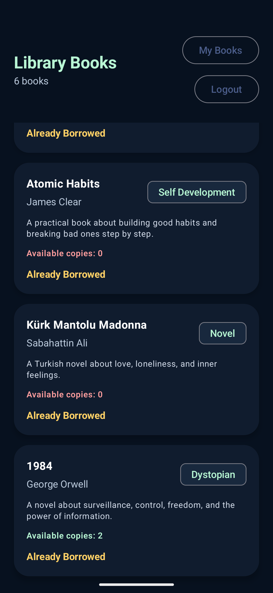
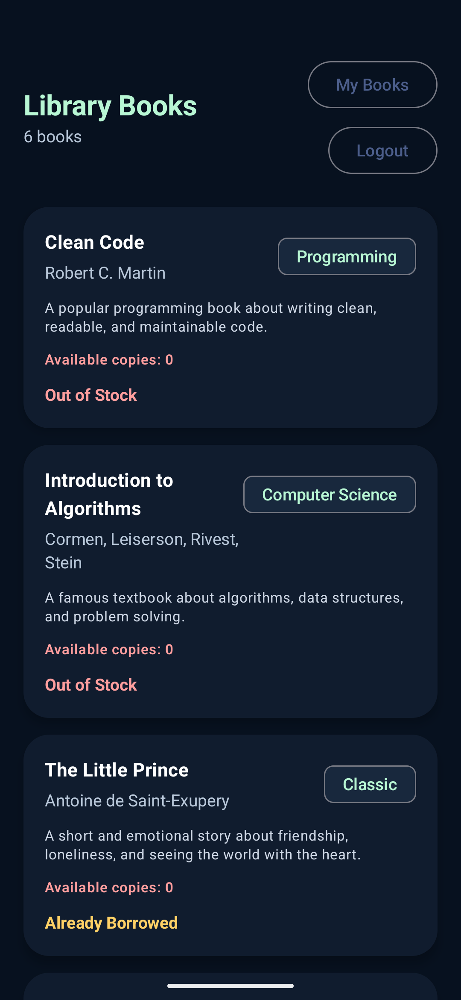
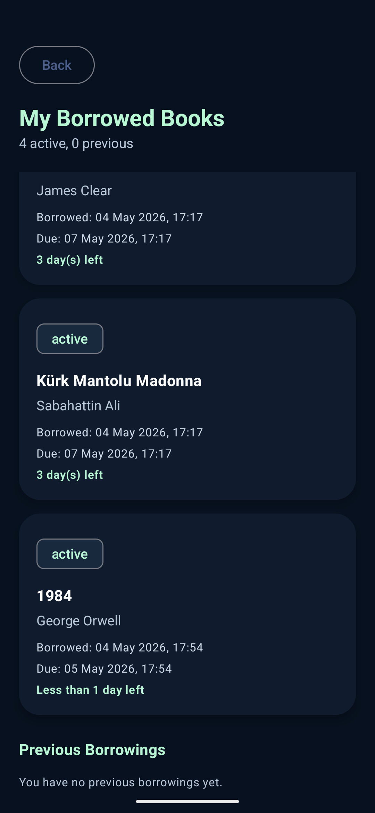

# LibraryApp - Supabase Based Android Library Application

LibraryApp is a Kotlin Android application developed with Jetpack Compose and Supabase.  
The app allows users to register, log in, view a digital book list, borrow books, and see their borrowed books.
---

## Features

## Features

- User registration with Supabase Auth
- User login and logout
- Book list fetched from Supabase database
- Book detail screen
- Borrow book feature
- Borrow duration selection between 1 and 5 days
- Prevents borrowing the same book more than once
- Updates available book copy count after borrowing
- Book cards show Borrow Book, Out of Stock, and Already Borrowed states
- My Borrowed Books screen
- Active and previous borrowings are shown separately
- Borrowed books show readable due dates and remaining time

---

## Technologies Used

- Kotlin
- Android Studio
- Jetpack Compose
- Material 3
- Navigation Compose
- ViewModel
- StateFlow
- Supabase Auth
- Supabase Database
- Supabase PostgREST / RPC
- Kotlin Serialization

---
## Screenshots

### Login and Register Flow

| Login Page | Login Failed | Create Account |
|---|---|---|
|  |  |  |

---

### Registration and Book List

| Registration Success | Book List Page | Borrow Book |
|---|---|---|
|  |  |  |

---

### Borrowed Books Screens

| Borrowed Books | Empty Borrowed Books | Borrow List 1 |
|---|---|---|
|  |  |  |

---

### Borrow Rules 

| Borrow Rule Warning | Same Book Cannot Be Borrowed Twice | Updated Borrow List |
|---|---|---|
|  |  |  |

---

### Search Feature

| Search Bar | Search Test |
|---|---|
|  |  |

---

### Final Borrowing Status Updates

| Book List Borrow Status | Out of Stock and Already Borrowed | Active and Previous Borrowings |
|---|---|---|
|  |  |  |
