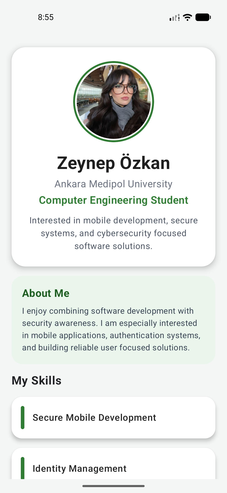
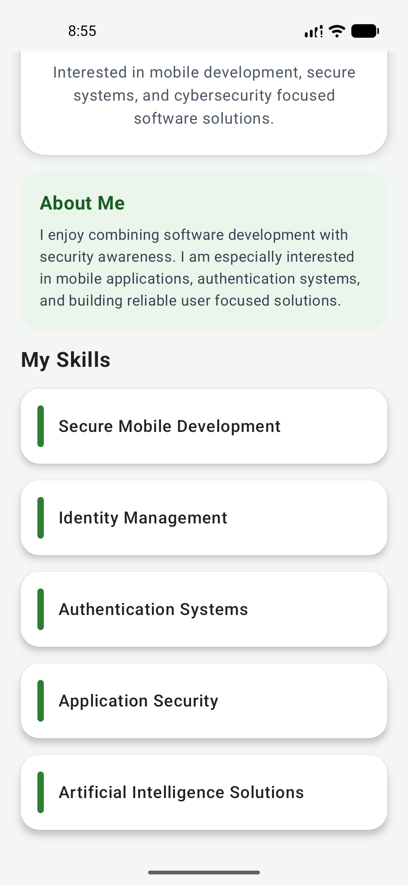

# Android Profile Introduction App

This project is a simple and modern Android profile application developed with Kotlin and Jetpack Compose.

## Overview

The application presents personal information, academic background, and technical skills in a clean and user-friendly mobile interface.

## Project Purpose

The main purpose of this project is to practice modern Android UI development and create a structured single-screen profile application.

## Features

- Displays a profile photo in a circular frame
- Presents personal and academic information in a structured profile card
- Includes an About Me section
- Lists technical skills using reusable card components
- Uses a clean and readable single-screen design

## What I Learned

Through this project, I practiced building a modern Android user interface with Jetpack Compose.

I learned how to:

- add and display image resources from the `drawable` folder
- style UI elements with colors, shapes, borders, spacing, and cards
- separate the screen into smaller reusable components such as profile, about, and skill sections
- create a cleaner and more readable mobile interface with modern UI components
- manage and present an Android Studio project in a GitHub repository with documentation

## Project Structure

This application is designed as a single-screen profile app using reusable composable components.

## Screenshots

  
  

## Developer

**Zeynep Özkan**
