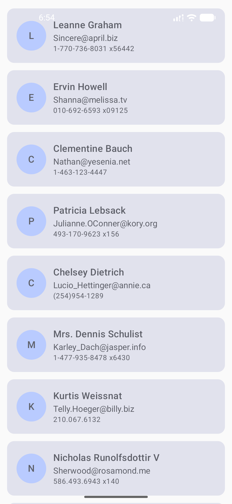
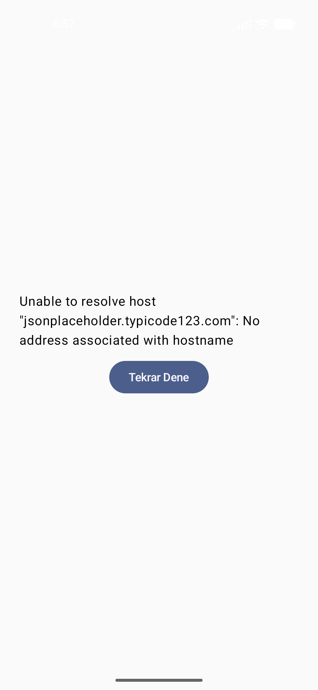

# User List App

A simple Android application built with **Kotlin**, **Jetpack Compose**, **MVVM**, **Retrofit**, and **StateFlow**.

The app fetches user data from the **JSONPlaceholder Users API** and displays it in a clean user list interface. It also handles three UI states: **Loading**, **Success**, and **Error**.

## Features

- Fetches user data from a remote API
- Displays users in a scrollable list
- Uses MVVM architecture
- Handles Loading, Success, and Error states
- Retry button for failed requests
- Modern UI built with Jetpack Compose and Material 3

## How to Run

1. Open the project in Android Studio
2. Sync Gradle files
3. Run the app on an emulator or Android device
4. Make sure internet permission is enabled in `AndroidManifest.xml`

## Screenshots

<p align="center">
  
  
  
</p>

## States Shown

- **Loading:** Shows a progress indicator while data is being fetched
- **Success:** Displays the user list in cards
- **Error:** Shows an error message and a retry button

## Technologies Used

- Kotlin
- Jetpack Compose
- MVVM
- Retrofit
- Gson Converter
- Coroutines
- StateFlow
- Material 3

## API

- JSONPlaceholder Users API  
- `https://jsonplaceholder.typicode.com/users`


## Project Structure

```text
com.example.userapp/
├── data/
│   ├── model/
│   ├── remote/
│   └── repository/
├── ui/
│   ├── components/
│   ├── screen/
│   └── theme/
└── viewmodel/


